# ULAK - Local Network File Sharing

<div align="center">


**Fast, Secure, and Easy File Sharing Across Your Local Network**

[](https://opensource.org/licenses/MIT)
[](https://github.com/cektor/ULAK)
[](https://www.python.org/)

[English](README.md) | [Türkçe](README-tr.md)

</div>

---

## 🌟 What is ULAK?

**ULAK** is a modern, cross-platform file sharing application that allows you to transfer files, text, and clipboard content between devices on your local network - **without internet connection**. Think of it as AirDrop for all platforms!

### Why ULAK?

- 🚀 **Lightning Fast** - Direct device-to-device transfer over local network
- 🔒 **Secure** - Optional AES-256 encryption for sensitive files
- 🎯 **Simple** - No configuration needed, just install and share
- 🌐 **Cross-Platform** - Works on Windows, Linux, macOS, Android, iOS, iPadOS, and watchOS
- 📡 **Wi-Fi Direct** - Direct device connection without a router (Windows, Linux, Android)
- 🔗 **Link Sharing** - Create browser-accessible shareable links for your files
- 📱 **Auto-Discovery** - Automatically finds devices on your network
- 💯 **Free & Open Source** - No ads, no tracking, no subscriptions

---

## ✨ Key Features

### 📁 File & Folder Sharing
- Send single or multiple files
- Share entire folders with all contents
- Drag & drop support
- Real-time transfer progress
- Multi-device simultaneous transfer

### 💬 Text & Clipboard Sharing
- Send text messages between devices
- Share clipboard content (text & images)
- Auto-copy received content to clipboard
- Perfect for quick notes and links

### 📸 Screenshot Sharing
- Capture and share screenshots instantly
- Quick shortcut: `Ctrl+Shift+S`
- 3-second countdown for preparation
- Direct send to selected devices

### 📡 Wi-Fi Direct
- Connect devices directly without a router or access point
- **Supported platforms:** Windows, Linux, Android
- Ideal for environments without internet access

### 🔗 Link Sharing
- Generate shareable links for your files
- Recipients can download via any browser
- **Supported on all platforms**

### 🔐 Security Features
- **AES-256 Encryption** - Military-grade encryption for your files
- **Password Protection** - Set custom encryption passwords
- **Local Network Only** - No data leaves your network
- **No Cloud Storage** - Direct peer-to-peer transfer

### 🎨 User Experience
- **Modern Dark Theme** - Easy on the eyes
- **Intuitive Interface** - No learning curve
- **System Tray Support** - Run in background
- **Notifications** - Get notified when files arrive
- **Transfer History** - Track received files

---

## 📸 Screenshots

<div align="center">

**ULAK on every platform**

</div>

<details open>
<summary><b>🪟 Windows</b></summary>
<br>
<p align="center">
  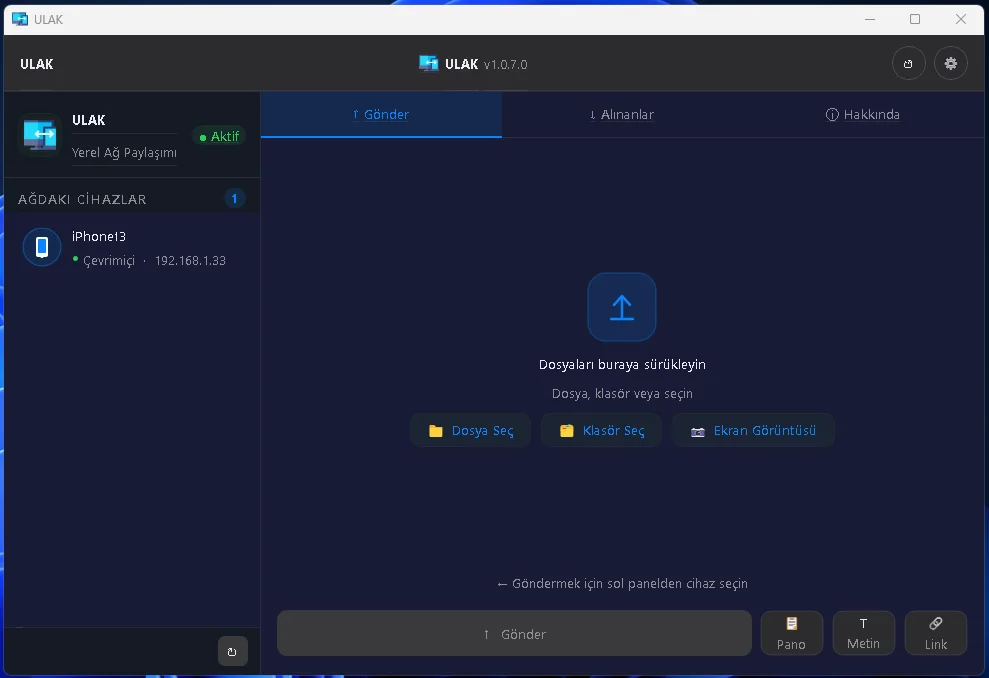
  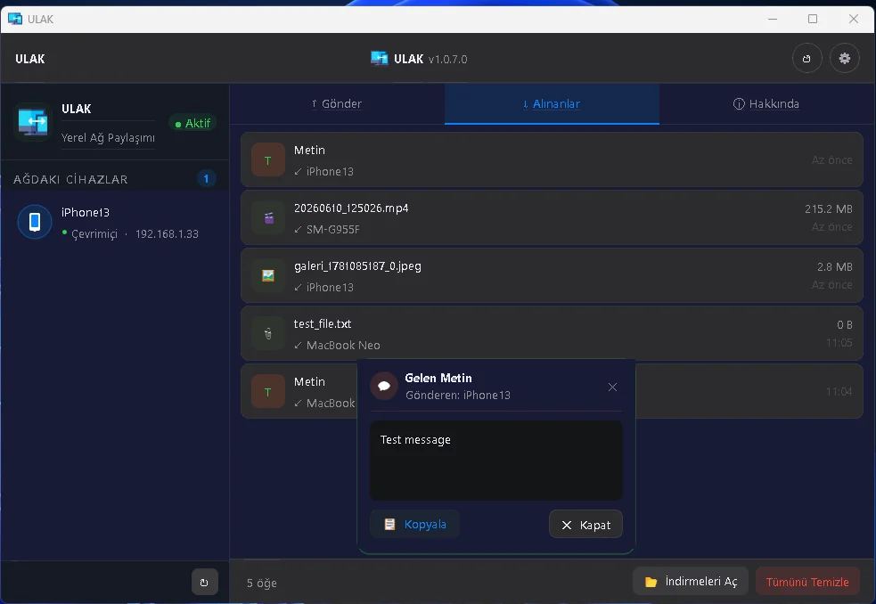
  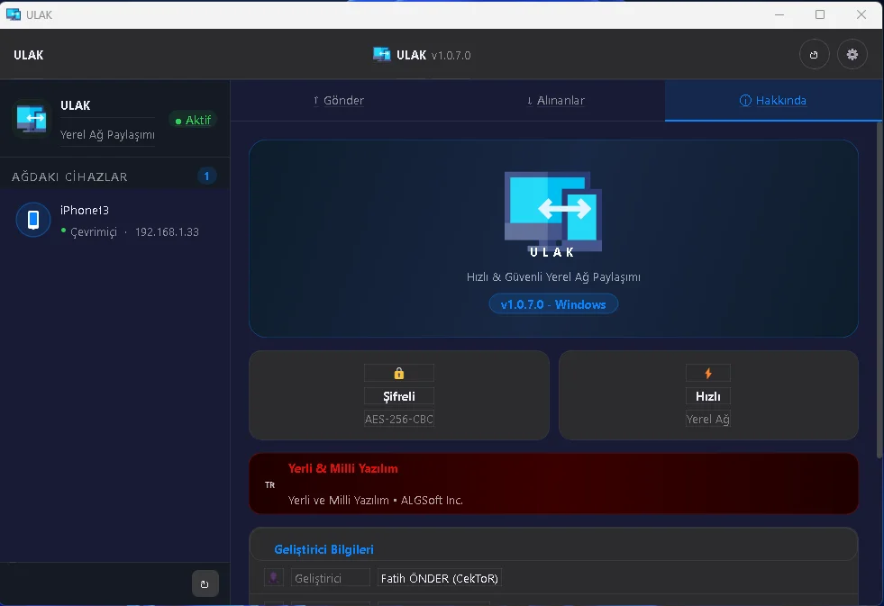
</p>
</details>

<details>
<summary><b>🍎 macOS</b></summary>
<br>
<p align="center">
  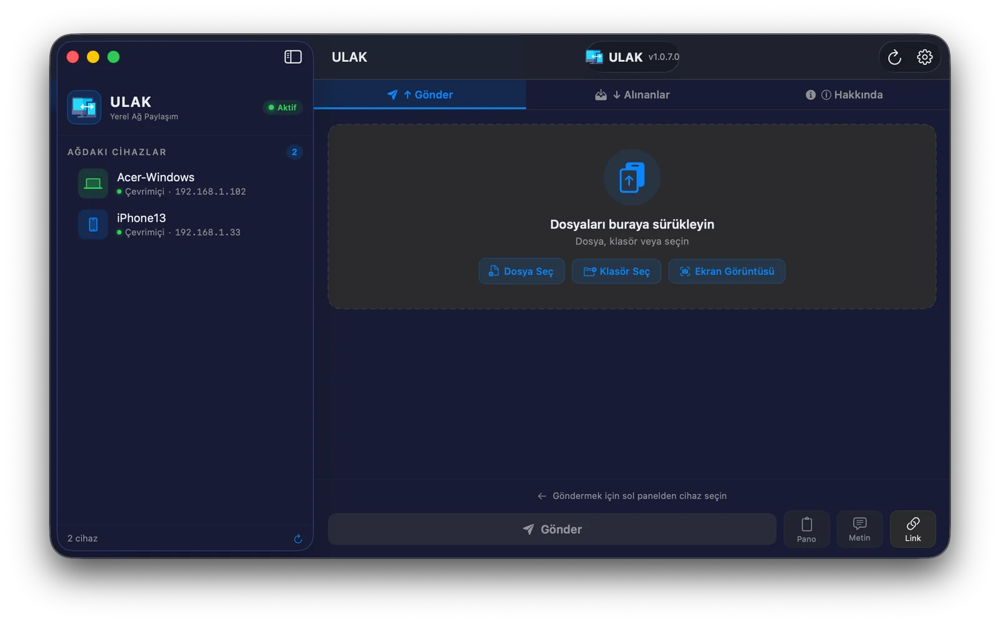
  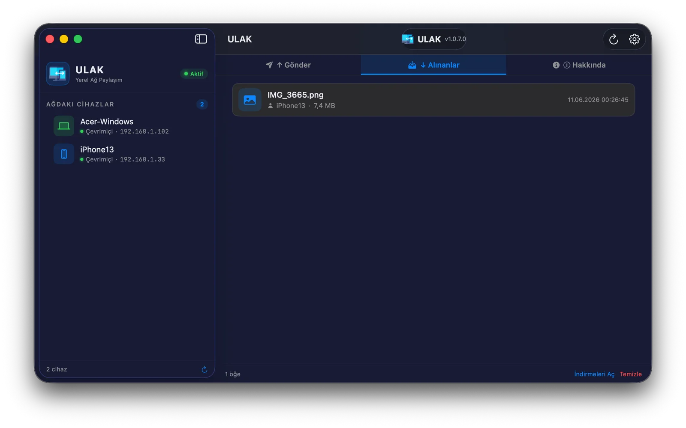
  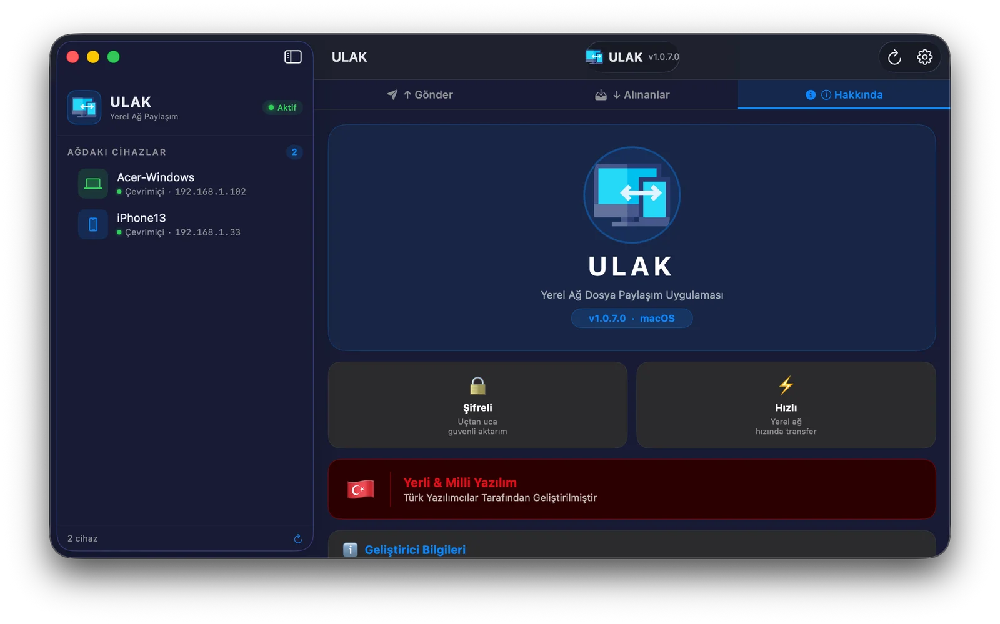
</p>
</details>

<details>
<summary><b>🐧 Linux</b></summary>
<br>
<p align="center">
  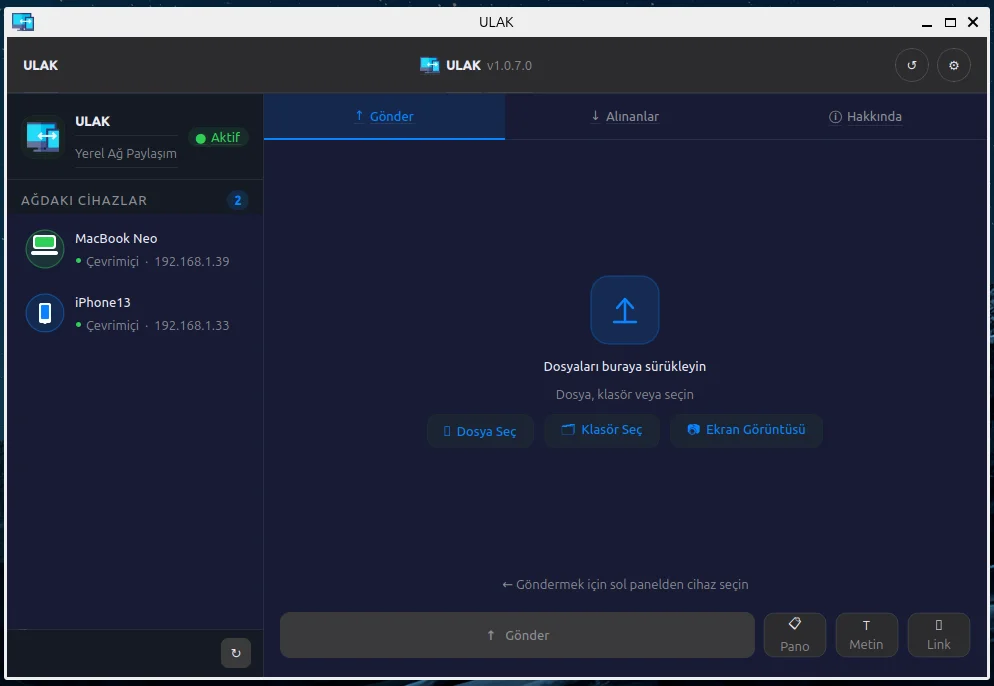
  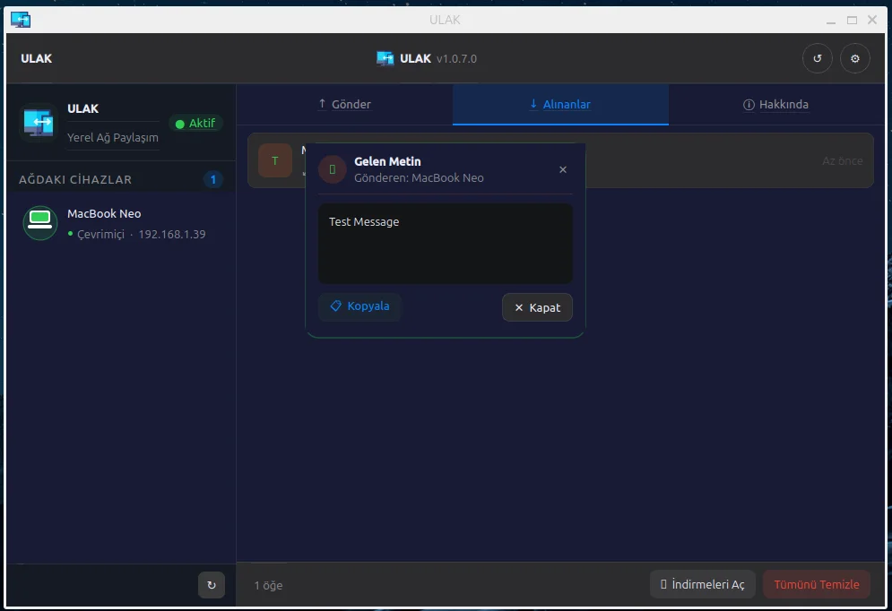
  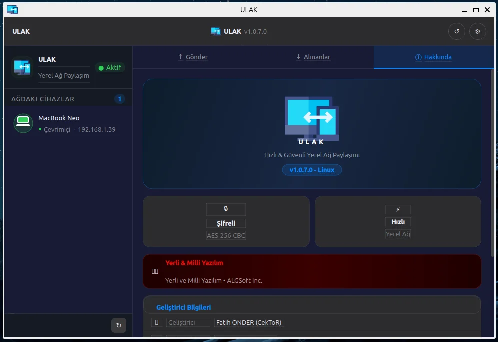
</p>
</details>

<details>
<summary><b>🤖 Android</b></summary>
<br>
<p align="center">
  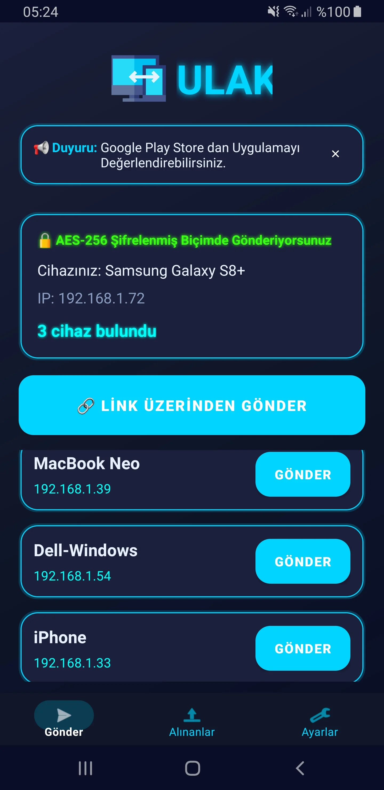
  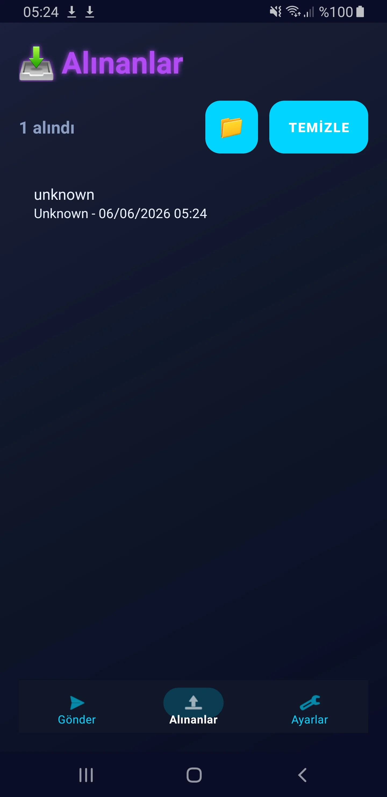
  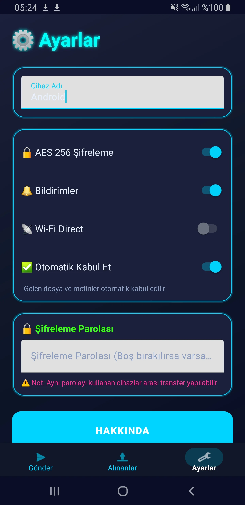
</p>
</details>

<details>
<summary><b>🍏 iOS / iPadOS</b></summary>
<br>
<p align="center">
  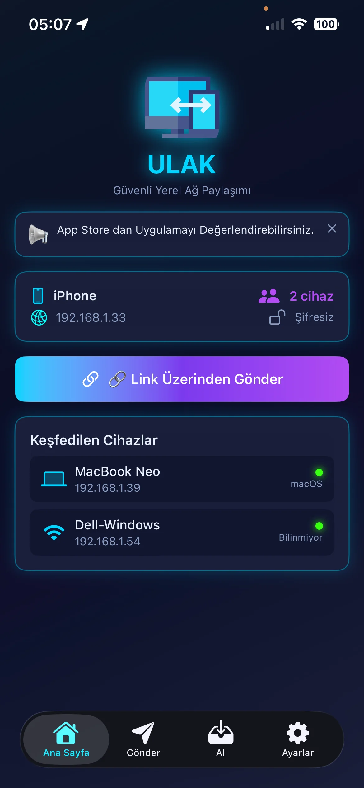
  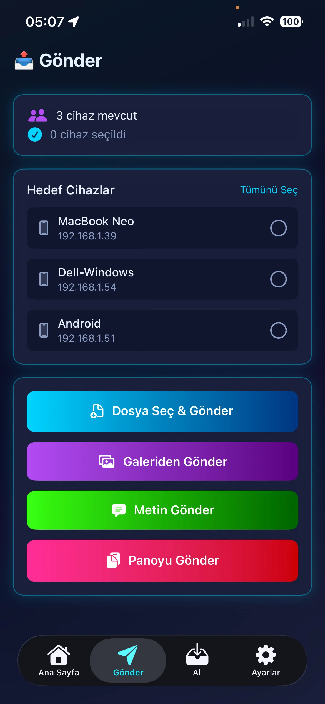
  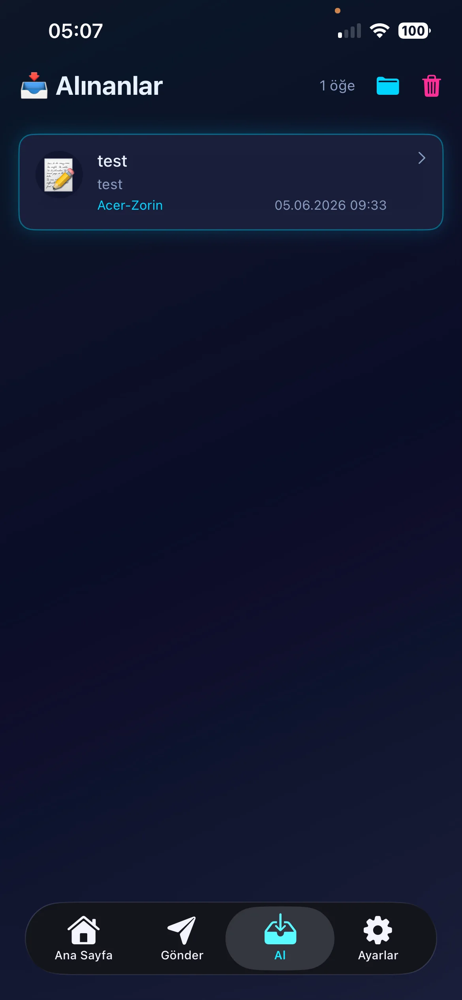
</p>
</details>

<details>
<summary><b>⌚ watchOS</b></summary>
<br>
<p align="center">
  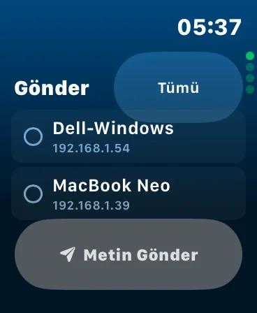
  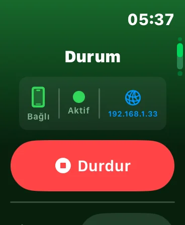
  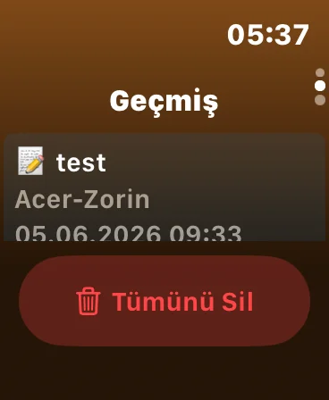
</p>
</details>

---

## 📱 Platform Support

### 🪟 Windows
- **Version**: Windows 10/11
- **Installation**: Portable executable, installer, or Microsoft Store
- **Features**: Full feature set including system tray, keyboard shortcuts, Wi-Fi Direct, and link sharing
- **Download**: [GitHub Releases](https://github.com/cektor/ULAK/releases) or [Microsoft Store](https://apps.microsoft.com/detail/9NPQX6K5RHQQ?hl=tr-tr&gl=TR&ocid=pdpshare)

### 🐧 Linux
- **Distributions**: Pardus, Ubuntu, Linux Mint, Zorin OS (All Debian-based Distributions) AppImage for Other Distributions
- **Installation**: System package, standalone Python script, or .DEB or AppImage
- **Features**: Full feature set with desktop integration, Wi-Fi Direct, and link sharing
- **Download**: [GitHub Releases](https://github.com/cektor/ULAK/releases)

### 🍎 macOS
- **Version**: macOS 11+ (Apple Silicon)
- **Installation**: Application bundle (.dmg)
- **Features**: Full feature set with native macOS integration and link sharing
- **Download**: [GitHub Releases](https://github.com/cektor/ULAK/releases) or [App Store](https://apps.apple.com)

### 🤖 Android
- **Version**: Android 7.0+
- **Installation**: [Google Play Store](https://play.google.com/store/apps/details?id=com.ulak) or APK download
- **Features**: Mobile-optimized interface with all core features including Wi-Fi Direct and link sharing
- **Permissions**: Network access, File and Gallery access
- **Download**: [Google Play Store](https://play.google.com/store/apps/details?id=com.ulak)

### 🍏 iOS / iPadOS
- **Version**: iOS 15+ / iPadOS 15+
- **Installation**: App Store
- **Features**: Mobile-optimized interface with all core features and link sharing
- **Permissions**: Network access, Files and Photos access
- **Download**: [App Store](https://apps.apple.com/tr/app/ulak-h%C4%B1zl%C4%B1-dosya-transferi/id6776188510?l=tr)

### ⌚ watchOS
- **Version**: watchOS 8+
- **Installation**: App Store (companion app)
- **Features**: Quick file sending, transfer notifications, and device discovery from your wrist
- **Note**: Requires ULAK installed on a paired iPhone

---

## 📥 Download

| Platform | Download |
|----------|---------|
| 🪟 Windows |  [GitHub Releases](https://github.com/cektor/ULAK/releases) or [Microsoft Store](https://apps.microsoft.com/detail/9NPQX6K5RHQQ?hl=tr-tr&gl=TR&ocid=pdpshare) |
| 🐧 Linux | [GitHub Releases](https://github.com/cektor/ULAK/releases) | AppImage
| 🍎 macOS | [GitHub Releases](https://github.com/cektor/ULAK/releases) or [App Store](https://apps.apple.com) |
| 🤖 Android | [GitHub Releases](https://github.com/cektor/ULAK/releases) or [Google Play Store](https://play.google.com/store/apps/details?id=com.ulak) |
| 🍏 iOS / iPadOS | [App Store](https://apps.apple.com/tr/app/ulak-h%C4%B1zl%C4%B1-dosya-transferi/id6776188510?l=tr) |
| ⌚ watchOS | [App Store](https://apps.apple.com) (companion app) |

---

## 🚀 Quick Start

### For Beginners

1. **Download ULAK** for your platform:
   - Windows: Download from [GitHub Releases](https://github.com/cektor/ULAK/releases), or [Microsoft Store](https://apps.microsoft.com/detail/9NPQX6K5RHQQ?hl=tr-tr&gl=TR&ocid=pdpshare)
   - Linux / macOS: Download from [GitHub Releases](https://github.com/cektor/ULAK/releases)
   - Android: Install from [Google Play Store](https://play.google.com/store/apps/details?id=com.ulak) or download the `.apk` file
   - iOS / iPadOS / watchOS: Install from [App Store](https://apps.apple.com/tr/app/ulak-h%C4%B1zl%C4%B1-dosya-transferi/id6776188510?l=tr)

2. **Install** the application on all devices you want to share files between

3. **Open ULAK** on each device - they will automatically discover each other

4. **Start Sharing**:
   - Select a device from the list
   - Click "Send File" or drag & drop files
   - Receiver will get a notification to accept
   - Done! Files are transferred

### For Advanced Users

#### Linux Installation
```bash
# Clone repository
git clone https://github.com/cektor/ULAK.git
cd ULAK/ulak_linux

# Install dependencies
pip3 install -r requirements.txt

# Install system-wide
sudo bash install.sh

# Run
ulak
```

#### Windows Installation
```bash
# Clone repository
git clone https://github.com/cektor/ULAK.git
cd ULAK

# Install dependencies
pip install -r requirements.txt

# Run
python main.py
```

---

## 📖 How to Use

### Sending Files

1. **Open ULAK** on both sender and receiver devices
2. **Wait** for devices to appear in the "Nearby Devices" list (2-3 seconds)
3. **Select** the target device(s) - you can select multiple!
4. **Choose files**:
   - Click "📄 Send File" for files
   - Click "📁 Send Folder" for folders
   - Or simply **drag & drop** files into the window
5. **Click "📤 Send"** button
6. **Receiver accepts** the transfer
7. **Done!** Files are saved to Downloads folder

### Sharing via Link

1. Select the file you want to share
2. Click "🔗 Create Link"
3. Copy the generated link and share it with the recipient
4. Recipient can download the file from any browser
5. Supported on all platforms

### Sharing via Wi-Fi Direct (Windows, Linux, Android)

1. Enable Wi-Fi Direct mode on both devices
2. Devices discover each other automatically
3. Proceed with the normal sharing flow
4. No router or internet connection required

### Sending Text

1. Select target device
2. Click "💬 Send Text"
3. Type or paste your message
4. Click "📨 Send"
5. Receiver gets a popup with the message

### Sending Clipboard

1. Copy text or image to clipboard
2. Select target device
3. Click "📋 Send Clipboard"
4. Receiver automatically gets it in their clipboard

### Taking & Sharing Screenshots

1. Select target device
2. Click "📸 Screenshot" or press `Ctrl+Shift+S`
3. Wait for 3-second countdown
4. Screenshot is captured and sent automatically

---

## 🔧 Configuration

### Settings Panel

Access settings from the "⚙️ Settings" tab:

#### Device Settings
- **Device Name**: Change how your device appears to others
- **Port**: Default 53317 (change if needed)
- **Broadcast Port**: Default 53318 (for device discovery)

#### Security Settings
- **🔒 Enable AES-256 Encryption**: Toggle encryption on/off
- **Encryption Password**: Set custom password (same on all devices)
- **Note**: Devices must use the same password to communicate

#### Notification Settings
- **🔔 Show Notifications**: Get notified when files arrive
- **🔊 Play Sound**: Audio notification on transfer complete
- **📥 Run in System Tray**: Minimize to tray instead of closing

#### Clipboard Settings
- **📋 Auto-copy Clipboard**: Automatically copy received text/images to clipboard

#### Download Settings
- **📁 Download Folder**: Choose where received files are saved

---

## 🔐 Security & Privacy

### What ULAK Does
- ✅ Transfers files directly between devices on local network
- ✅ Optionally encrypts files with AES-256
- ✅ Stores settings locally on your device
- ✅ Auto-discovers devices using UDP broadcast
- ✅ Connects devices directly via Wi-Fi Direct without a router

### What ULAK Does NOT Do
- ❌ Does not connect to the internet
- ❌ Does not upload files to any server
- ❌ Does not collect any personal data
- ❌ Does not track your usage
- ❌ Does not require account or login

### Encryption Details
- **Algorithm**: AES-256-CBC
- **Key Derivation**: SHA-256 hash of password
- **Default Key**: Used if no password set
- **Compatibility**: Works across all platforms

---

## 🌐 Network Requirements

### What You Need
- All devices must be on the **same local network** (same WiFi/router) **or** use Wi-Fi Direct
- **Ports 53317 and 53318** must be open (usually automatic)
- No internet connection required

### Firewall Configuration
If devices don't see each other:

**Windows**:
```
Allow ULAK through Windows Firewall
```

**Linux**:
```bash
sudo ufw allow 53317/tcp
sudo ufw allow 53318/udp
```

**Android / iOS / iPadOS / macOS**:
```
Usually no configuration needed
```

---

## 📦 Installation Details

### Windows
- **Portable**: Just run the `.exe` file
- **Requirements**: Windows 10/11, no additional software needed
- **Download**: [GitHub Releases](https://github.com/cektor/ULAK/releases) or [Microsoft Store](https://apps.microsoft.com/detail/9NPQX6K5RHQQ?hl=tr-tr&gl=TR&ocid=pdpshare)

### Linux
- **System Installation**: Installs to `/usr/share/ulak/`
- **Icon**: Placed in `/usr/share/pixmaps/ulaklo.png`
- **Desktop Entry**: Added to application menu
- **Config**: Stored in `~/.config/ulak/`
- **Requirements**: Python 3.8+, PyQt5, cryptography
- **Download**: [GitHub Releases](https://github.com/cektor/ULAK/releases)

### macOS
- **Requirements**: macOS 11+ (Apple Silicon supported)
- **Download**: [GitHub Releases](https://github.com/cektor/ULAK/releases) or [App Store](https://apps.apple.com)

### Android
- **Play Store**: [Download from Google Play](https://play.google.com/store/apps/details?id=com.ulak)
- **APK Installation**: Enable "Unknown Sources" in settings
- **Permissions**: Network access, File and Gallery access
- **Storage**: Downloads folder
- **Requirements**: Android 7.0+

### iOS / iPadOS
- **App Store**: [Download from App Store](https://apps.apple.com/tr/app/ulak-h%C4%B1zl%C4%B1-dosya-transferi/id6776188510?l=tr)
- **Permissions**: Network access, Files and Photos access
- **Storage**: Files app / Downloads folder
- **Requirements**: iOS 15+ / iPadOS 15+

### watchOS
- **App Store**: [Download from App Store](https://apps.apple.com/tr/app/ulak-h%C4%B1zl%C4%B1-dosya-transferi/id6776188510?l=tr) (companion app, installed automatically with iPhone app)
- **Requirements**: watchOS 8+, paired iPhone with ULAK installed

---

## 🛠️ Technical Details

### Architecture
- **Protocol**: TCP/IP for file transfer, UDP for device discovery
- **Port**: 53317 (transfer), 53318 (discovery)
- **Buffer Size**: 8192 bytes
- **Encryption**: AES-256-CBC with PKCS7 padding
- **UI Framework**: PyQt5 (Desktop), Android SDK (Mobile)

### File Transfer Process
1. Sender broadcasts presence on UDP port 53318
2. Receiver discovers sender and adds to device list
3. User selects file and target device
4. Sender sends file metadata (name, size, encryption status)
5. Receiver shows accept/reject dialog
6. If accepted, file is transferred over TCP port 53317
7. Progress is shown in real-time
8. Receiver saves file to Downloads folder

### Folder Transfer
- Folders are automatically zipped before transfer
- Extracted automatically on receiver side
- Preserves folder structure
- Shows file/folder count before transfer

---

## 🤝 Contributing

We welcome contributions! Here's how you can help:

### Reporting Bugs
- Open an issue on [GitHub Issues](https://github.com/cektor/ULAK/issues)
- Include your OS, ULAK version, and steps to reproduce

### Feature Requests
- Open an issue with the "enhancement" label
- Describe the feature and why it would be useful

### Code Contributions
1. Fork the repository
2. Create a feature branch
3. Make your changes
4. Test thoroughly
5. Submit a pull request

### Translation
- Help translate ULAK to your language
- Edit language files in `/locales/`

---

## 📝 Changelog

### Version 1.0.0 (Current)
- ✨ Initial release
- 📁 File and folder sharing
- 💬 Text messaging
- 📋 Clipboard sharing
- 📸 Screenshot sharing
- 🔒 AES-256 encryption
- 🌐 Cross-platform support (Windows, Linux, macOS, Android, iOS, iPadOS, watchOS)
- 📡 Wi-Fi Direct support (Windows, Linux, Android)
- 🔗 Link sharing support (All platforms)
- 🎨 Modern dark theme UI
- 📊 Real-time transfer progress
- 🔔 Notifications and sounds

---

## 🆘 Troubleshooting

### Devices Not Showing Up
1. Ensure all devices are on the same network
2. Check firewall settings
3. Try restarting ULAK on both devices
4. Verify ports 53317 and 53318 are not blocked

### Transfer Fails
1. Check if encryption settings match on both devices
2. Ensure enough disk space on receiver
3. Try disabling encryption temporarily
4. Check network stability

### Encryption Password Issues
1. Both devices must use the exact same password
2. Password is case-sensitive
3. Leave blank to use default encryption
4. Change password in Settings → Save → Restart ULAK

### Linux Icon Not Showing
1. Run: `sudo gtk-update-icon-cache -f -t /usr/share/pixmaps`
2. Log out and log back in
3. Check if icon exists: `ls /usr/share/pixmaps/ulaklo.png`

---

## 📞 Support & Contact

### Get Help
- 📧 Email: info@algsoft.net.tr
- 🌐 Website: https://ulak.algsoft.net.tr
- 🐱 GitHub: https://github.com/cektor/ULAK
- 📖 Documentation: [Wiki](https://github.com/cektor/ULAK/wiki)

### Community
- Report bugs: [GitHub Issues](https://github.com/cektor/ULAK/issues)
- Feature requests: [GitHub Discussions](https://github.com/cektor/ULAK/discussions)
- Follow updates: [GitHub Releases](https://github.com/cektor/ULAK/releases)

---

## 👨‍💻 Credits

### Developer
**Fatih ÖNDER (CekToR)**
- GitHub: [@cektor](https://github.com/cektor)
- Email: fatih@algsoft.net.tr

### Company
**ALGSoft Inc.**
- Website: https://algsoft.net.tr
- Email: info@algsoft.net.tr

### Special Thanks
- PyQt5 team for the excellent UI framework
- Cryptography library contributors
- All beta testers and early users

---

## 📄 License

ULAK is licensed under the **MIT License**.

```
MIT License

Copyright (c) 2025 ALGSoft Inc.

Permission is hereby granted, free of charge, to any person obtaining a copy
of this software and associated documentation files (the "Software"), to deal
in the Software without restriction, including without limitation the rights
to use, copy, modify, merge, publish, distribute, sublicense, and/or sell
copies of the Software, and to permit persons to whom the Software is
furnished to do so, subject to the following conditions:

The above copyright notice and this permission notice shall be included in all
copies or substantial portions of the Software.

THE SOFTWARE IS PROVIDED "AS IS", WITHOUT WARRANTY OF ANY KIND, EXPRESS OR
IMPLIED, INCLUDING BUT NOT LIMITED TO THE WARRANTIES OF MERCHANTABILITY,
FITNESS FOR A PARTICULAR PURPOSE AND NONINFRINGEMENT. IN NO EVENT SHALL THE
AUTHORS OR COPYRIGHT HOLDERS BE LIABLE FOR ANY CLAIM, DAMAGES OR OTHER
LIABILITY, WHETHER IN AN ACTION OF CONTRACT, TORT OR OTHERWISE, ARISING FROM,
OUT OF OR IN CONNECTION WITH THE SOFTWARE OR THE USE OR OTHER DEALINGS IN THE
SOFTWARE.
```

---

## 🌟 Star History

If you find ULAK useful, please consider giving it a star on GitHub! ⭐

---

<div align="center">

**Made with ❤️ by ALGSoft Inc.**

[Download](https://ulak.algsoft.net.tr) • [GitHub](https://github.com/cektor/ULAK/releases) • [Microsoft Store](https://apps.microsoft.com/detail/9NPQX6K5RHQQ?hl=tr-tr&gl=TR&ocid=pdpshare) • [Play Store](https://play.google.com/store/apps/details?id=com.ulak) • [App Store](https://apps.apple.com) • [Report Bug](https://github.com/cektor/ULAK/issues)

</div>
